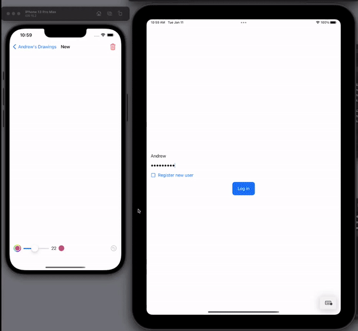
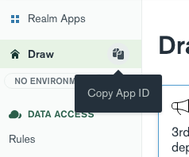

# Realm-Draw Backend Atlas App
This is the backend Realm app for Realm-Draw.



## Configure and Run

1. If you don't already have one, [create a MongoDB Atlas Cluster](https://cloud.mongodb.com/), keeping the default name of `Cluster0`.
1. Install the [Realm CLI](https://docs.mongodb.com/realm/deploy/realm-cli-reference) and [create an API key pair](https://docs.atlas.mongodb.com/configure-api-access#programmatic-api-keys).
1. Download the repo and install the Realm app:
```
git clone git@github.com:mongodb-developer/Realm-Draw.git
cd Realm-Draw/AtlasAppService
realm-cli login --api-key <your new public key> --private-api-key <your new private key>
realm-cli import # Then answer prompts, naming the app Realm-Draw
```
4. From the Atlas UI, click on the App Services tab and you will see the Draw app. Open it and copy the App Id



5. Use that App ID in the [iOS app](../iOS)